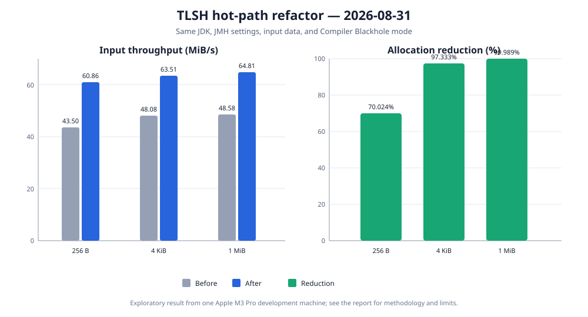

# Removing per-window allocations

Date: 2026-08-31

Status: exploratory result from one development machine, not a general performance claim.

## Question

The initial implementation created a defensive five-byte window snapshot and a six-element array of
bucket indices for every full sliding window. The benchmark asked whether recording Pearson results
directly in the histogram could remove that allocation without changing TLSH output and whether the
change affected complete-hash throughput.

## Change

Before the refactor, every byte after the first four caused two temporary arrays to be created:

```text
byte[5] snapshot  approximately 24 bytes
int[6] indices    approximately 40 bytes
------------------------------------------------
                    approximately 64 bytes per full window
```

After the refactor, internal stages read individual bytes from `SlidingWindow` and `BucketMapper`
records every Pearson result directly in `Histogram`. The public API and digest representation did
not change. Compatibility vectors and the complete regular test suite passed before measuring the
new implementation.



## Results

Throughput results include the 99.9% confidence interval reported by JMH. MiB/s is derived from the
operation rate and the exact input size. The report uses binary units: 1 KiB is 1,024 bytes and 1 MiB
is 1,048,576 bytes. In contrast, the decimal SI unit 1 MB is 1,000,000 bytes.

| Input | Before, ops/s | After, ops/s | Before, MiB/s | After, MiB/s | Change |
| ---: | ---: | ---: | ---: | ---: | ---: |
| 256 B | 178,191.470 ± 10,217.065 | 249,297.712 ± 2,557.093 | 43.50 | 60.86 | +39.90% |
| 4 KiB | 12,308.441 ± 402.563 | 16,257.330 ± 633.314 | 48.08 | 63.51 | +32.08% |
| 1 MiB | 48.581 ± 0.094 | 64.805 ± 2.449 | 48.58 | 64.81 | +33.40% |

Normalized allocation measures the number of bytes allocated during one complete hash operation.

| Input | Before, B/op | After, B/op | Reduction | Before / after |
| ---: | ---: | ---: | ---: | ---: |
| 256 B | 23,032.013 | 6,904.009 | 70.024% | 3.34× |
| 4 KiB | 269,064.189 | 7,176.143 | 97.333% | 37.49× |
| 1 MiB | 67,115,910.834 | 7,272.947 | 99.989% | 9,228.16× |

The old allocation increased by approximately 64 bytes for every additional input byte. After the
change, allocation remains close to 7 KiB even when input grows from 256 bytes to 1 MiB. This is
evidence that the per-window arrays were removed from the measured path; the remaining allocation is
primarily fixed hasher construction and digest-finalization work.

## Method

Both measurements used the same benchmark source, input generator, JVM, JMH configuration, and
compiler Blackhole mode:

```shell
./gradlew :tlsh-benchmarks:jmh \
  -Pjmh.includes=TlshHashBenchmark \
  -Pjmh.forks=3 \
  -Pjmh.warmupIterations=5 \
  -Pjmh.iterations=5 \
  -Pjmh.warmupTime=3s \
  -Pjmh.measurementTime=3s \
  -Pjmh.profilers=gc
```

| Setting | Value |
| --- | --- |
| Benchmark | `TlshHashBenchmark.hashByteArray` |
| Mode | Throughput, one thread |
| Samples | 3 forks × 5 measurement iterations = 15 |
| Warmup | 5 iterations × 3 seconds per fork |
| Measurement | 5 iterations × 3 seconds per fork |
| Profiler | JMH `gc` |
| Blackhole | Compiler Blackhole, automatically selected by JMH |
| JMH | 1.37 |
| JVM | Eclipse Temurin 25.0.2+10 LTS, 64-bit Server VM |
| Hardware | MacBook Pro, Apple M3 Pro, 12 cores, 36 GB RAM |
| Operating system | macOS 26.5.2, arm64 |

## Limits

This is a before-and-after experiment on one machine and one day. Power mode, temperature, and
background system activity were not independently controlled. The result is strong evidence for
removing the identified allocation pattern, especially because normalized allocation changed by
four orders of magnitude for 1 MiB input. It is not evidence that every machine or JVM will show the
same throughput improvement. Future comparisons should retain the same Blackhole mode and record any
environment or benchmark changes.
