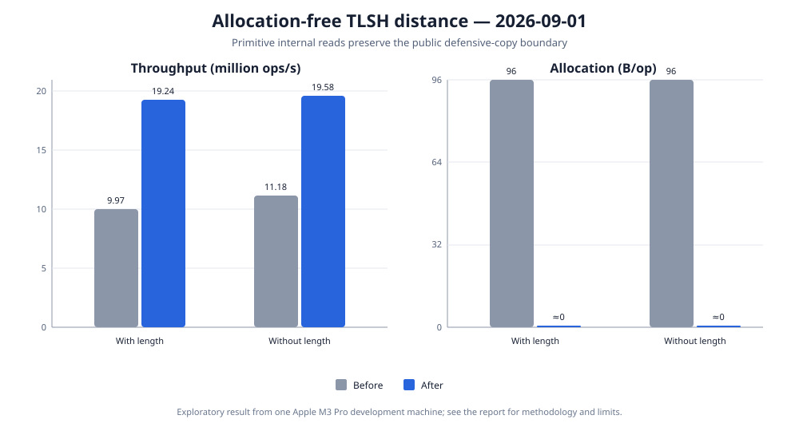

# Allocation-free distance calculation

Date: 2026-09-01

Status: exploratory result from one development machine, not a general performance claim.

## Question

The digest-operation baseline found that every distance calculation allocated exactly 96 bytes.
The public `TlshDigest.histogramCode()` accessor correctly returns a defensive copy so callers cannot
mutate the digest, but the internal distance calculator used that public path twice and therefore
copied both 32-byte histogram arrays for every comparison.

The refactor adds a package-private operation that returns one primitive histogram byte. The
distance calculator can read all packed values without receiving an array reference, while public
callers still receive a defensive copy. This experiment checks whether that design removes
allocation and whether it changes throughput.



## Results

Both measurements used the same machine, JDK, JMH options, fixed digest pair, and Compiler Blackhole
mode. They were separate JMH invocations, so the comparison includes ordinary run-to-run variation.
Throughput shows the 99.9% confidence interval reported by JMH.

| Distance mode | Before, ops/s | After, ops/s | Change | Before, B/op | After, B/op |
| --- | ---: | ---: | ---: | ---: | ---: |
| Including length | 9,974,897.604 ± 1,821,167.717 | 19,241,517.667 ± 147,471.294 | +92.90% | 96.000 | ≈0 |
| Excluding length | 11,180,483.897 ± 1,761,573.587 | 19,579,877.469 ± 11,422.944 | +75.13% | 96.000 | ≈0 |

One comparison now takes approximately 52.0 ns with length or 51.1 ns without length, down from
approximately 100.3 ns and 89.4 ns respectively. JMH reported no garbage collections during either
optimized distance benchmark. At one million comparisons, the implementation avoids approximately
96 MB of temporary allocation.

The parser benchmark served as an experimental control. It changed from 16,613,322 to 16,708,329
operations per second, only +0.57%, retained exactly 272 B/op, and has overlapping confidence
intervals across the two runs. The much larger distance improvement is therefore consistent with
the targeted code change rather than a machine-wide speed shift.

## Safety

The public `histogramCode()` method still returns a clone, and its existing test still proves that
neither the constructor's input array nor an accessor result can mutate a digest. Only code in the
implementation package can call the new primitive-byte reader. It returns a value rather than the
array reference, so even internal callers cannot use it to modify the stored histogram. All pinned
digest and official distance tests remained unchanged and passed after the refactor.

## Method

The optimized version was measured with the exact baseline command:

```shell
caffeinate -dims ./gradlew :tlsh-benchmarks:jmh \
  -Pjmh.includes=TlshDigestBenchmark \
  -Pjmh.forks=3 \
  -Pjmh.warmupIterations=5 \
  -Pjmh.iterations=5 \
  -Pjmh.warmupTime=3s \
  -Pjmh.measurementTime=3s \
  -Pjmh.profilers=gc
```

| Setting | Value |
| --- | --- |
| Mode | Throughput, one thread |
| Samples | 3 forks × 5 measurement iterations = 15 per operation |
| Warmup | 5 iterations × 3 seconds per fork |
| Measurement | 5 iterations × 3 seconds per fork |
| Profiler | JMH `gc` |
| Blackhole | Compiler Blackhole, automatically selected by JMH |
| JMH | 1.37 |
| JVM | Eclipse Temurin 25.0.2+10 LTS, 64-bit Server VM |
| Hardware | MacBook Pro, Apple M3 Pro, 12 cores, 36 GB RAM |
| Operating system | macOS 26.5.2, arm64 |

## Limits

The result describes one machine, one digest pair, and one before/after run. It does not establish
performance for every JVM or workload. The benchmark does establish the allocation mechanism more
strongly: normalized allocation was exactly 96 B/op in all baseline samples and below JMH's useful
per-operation resolution after the targeted removal of two defensive copies.
