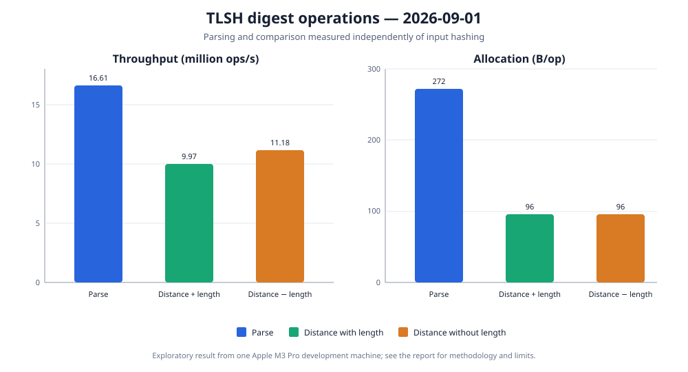

# Digest parsing and distance calculation

Date: 2026-09-01

Status: exploratory result from one development machine, not a general performance claim.

## Question

Hashing an input includes byte processing, histogram construction, and digest assembly. Once a
digest exists, applications may parse it from stored text and compare it many times. This experiment
measures those smaller operations independently so hashing cost does not hide their throughput and
allocation behavior.

The parsing benchmark repeatedly parses one valid canonical 72-character `T1` string. The distance
benchmarks compare two structured digests created before measurement, either including or excluding
the encoded-length contribution.



## Results

Throughput includes the 99.9% confidence interval reported by JMH. Approximate ns/op is derived from
the throughput score to make the cost of one operation easier to read.

| Operation | Throughput, ops/s | Approximate ns/op | Allocation, B/op |
| --- | ---: | ---: | ---: |
| Parse canonical digest | 16,613,322.130 ± 94,430.948 | 60.19 | 272.000 |
| Distance including length | 9,974,897.604 ± 1,821,167.717 | 100.25 | 96.000 |
| Distance excluding length | 11,180,483.897 ± 1,761,573.587 | 89.44 | 96.000 |

Parsing is stable in this run and creates the returned digest plus its owned data. Both distance
modes have overlapping confidence intervals, so this experiment does not establish that either mode
is faster. Their exact `96 B/op` result is more actionable: the distance calculator obtains each
digest's histogram through a defensive-copying public accessor. Two 32-byte arrays plus their object
headers account for the measured allocation.

The defensive copies preserve the public digest's immutability, so removing them requires an
internal access design that cannot expose mutable state to users. This baseline gives a direct test
for that future refactor: compatibility must remain unchanged while distance allocation approaches
zero.

## Method

All three operations were measured in the same JMH invocation:

```shell
caffeinate -dims ./gradlew :tlsh-benchmarks:jmh \
  -Pjmh.includes=TlshDigestBenchmark \
  -Pjmh.forks=3 \
  -Pjmh.warmupIterations=5 \
  -Pjmh.iterations=5 \
  -Pjmh.warmupTime=3s \
  -Pjmh.measurementTime=3s \
  -Pjmh.profilers=gc
```

| Setting | Value |
| --- | --- |
| Benchmarks | `parseDigest`, `distanceIncludingLength`, `distanceExcludingLength` |
| Mode | Throughput, one thread |
| Samples | 3 forks × 5 measurement iterations = 15 per operation |
| Warmup | 5 iterations × 3 seconds per fork |
| Measurement | 5 iterations × 3 seconds per fork |
| Profiler | JMH `gc` |
| Blackhole | Compiler Blackhole, automatically selected by JMH |
| JMH | 1.37 |
| JVM | Eclipse Temurin 25.0.2+10 LTS, 64-bit Server VM |
| Hardware | MacBook Pro, Apple M3 Pro, 12 cores, 36 GB RAM |
| Operating system | macOS 26.5.2, arm64 |

## Limits

The result describes one machine and one run. The benchmark uses two fixed valid digests; other
values can exercise different branches, although every standard digest has the same histogram-code
size. Distance throughput varied noticeably between iterations and should be treated as a baseline
range rather than a precise ranking of the two modes. Allocation per operation was stable across all
15 measurements and is the stronger signal for the next experiment.
