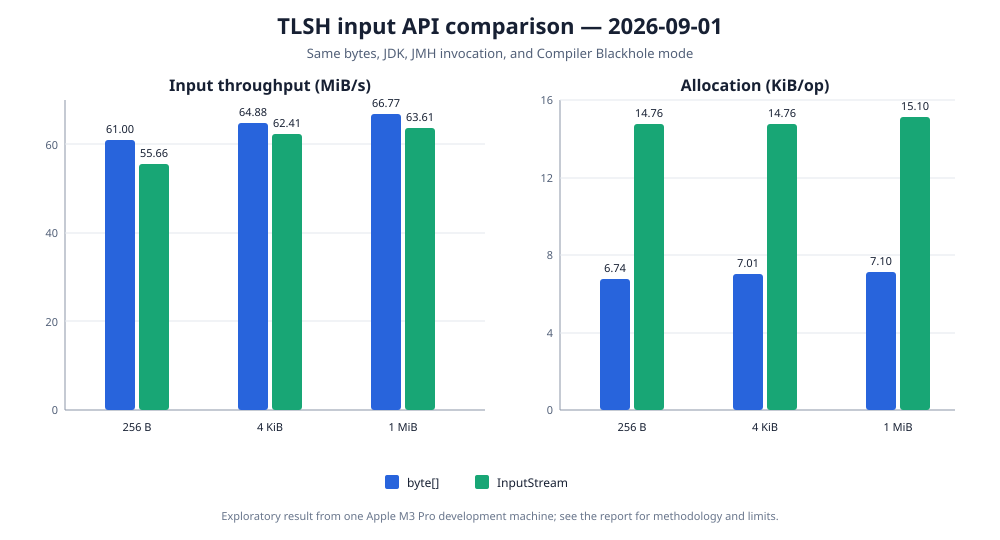

# Byte-array and input-stream hashing

Date: 2026-09-01

Status: exploratory result from one development machine, not a general performance claim.

## Question

`Tlsh.hash(byte[])` processes bytes already held in memory. `Tlsh.hash(InputStream)` offers a
convenient streaming API that allocates an 8 KiB read buffer and repeatedly passes populated chunks
to the same incremental hasher. This experiment measures the throughput and allocation cost of that
convenience layer while keeping the underlying input bytes identical.

The benchmark reuses a `ByteArrayInputStream` created before measurement and resets it before every
operation. Stream-object construction, filesystem access, and physical storage are excluded. The
measured stream result includes the library's read loop and its internally allocated buffer.



## Results

Throughput includes the 99.9% confidence interval reported by JMH. MiB/s is derived from the exact
input size; 1 MiB is 1,048,576 bytes.

| Input | `byte[]`, ops/s | `InputStream`, ops/s | `byte[]`, MiB/s | `InputStream`, MiB/s | Stream change |
| ---: | ---: | ---: | ---: | ---: | ---: |
| 256 B | 249,864.080 ± 2,857.124 | 228,001.038 ± 847.775 | 61.00 | 55.66 | −8.75% |
| 4 KiB | 16,608.555 ± 600.478 | 15,976.725 ± 25.739 | 64.88 | 62.41 | −3.80% |
| 1 MiB | 66.769 ± 2.299 | 63.613 ± 2.372 | 66.77 | 63.61 | −4.73% |

Normalized allocation measures the number of bytes allocated during one complete hash operation.

| Input | `byte[]`, B/op | `InputStream`, B/op | Additional stream allocation |
| ---: | ---: | ---: | ---: |
| 256 B | 6,904.009 | 15,112.010 | 8,208.001 B |
| 4 KiB | 7,176.140 | 15,112.145 | 7,936.005 B |
| 1 MiB | 7,270.819 | 15,465.954 | 8,195.135 B |

The approximately 8 KiB difference is consistent with the library's one `byte[8192]` read buffer
per call. It remains roughly constant as input grows, rather than reintroducing allocation for every
processed byte. For 1 MiB input the stream API is approximately 4.7% slower and allocates about 15
KiB for the complete operation. This is a reasonable baseline for a convenience method that owns
its buffer; callers that already manage chunks can use `TlshHasher` directly.

## Method

Both APIs were measured in the same JMH invocation:

```shell
caffeinate -dims ./gradlew :tlsh-benchmarks:jmh \
  -Pjmh.includes=TlshHashBenchmark \
  -Pjmh.forks=3 \
  -Pjmh.warmupIterations=5 \
  -Pjmh.iterations=5 \
  -Pjmh.warmupTime=3s \
  -Pjmh.measurementTime=3s \
  -Pjmh.profilers=gc
```

| Setting | Value |
| --- | --- |
| Benchmarks | `hashByteArray`, `hashInputStream` |
| Mode | Throughput, one thread |
| Samples | 3 forks × 5 measurement iterations = 15 per input and API |
| Warmup | 5 iterations × 3 seconds per fork |
| Measurement | 5 iterations × 3 seconds per fork |
| Profiler | JMH `gc` |
| Blackhole | Compiler Blackhole, automatically selected by JMH |
| JMH | 1.37 |
| JVM | Eclipse Temurin 25.0.2+10 LTS, 64-bit Server VM |
| Hardware | MacBook Pro, Apple M3 Pro, 12 cores, 36 GB RAM |
| Operating system | macOS 26.5.2, arm64 |

## Limits

The result describes one machine and one run. Power mode, temperature, and background activity were
not independently controlled, although `caffeinate` prevented idle sleep. The two APIs were measured
with the same inputs, JVM, JMH options, and Blackhole mode, making their within-run comparison more
useful than comparing unrelated runs. Other stream implementations can add their own buffering,
decompression, network, or storage costs that this in-memory experiment intentionally excludes.
