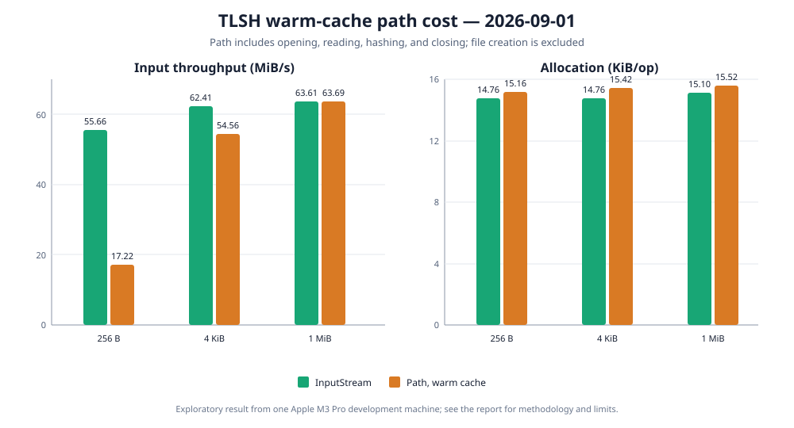

# Warm-cache path hashing

Date: 2026-09-01

Status: exploratory result from one development machine, not a general performance claim.

## Question

`Tlsh.hash(InputStream)` measures the library's stream-processing layer with an already open,
in-memory stream. `Tlsh.hash(Path)` additionally asks the operating system to open the file before
hashing and close it afterwards. This experiment isolates the practical cost of that convenience
for a file that already exists in the operating-system filesystem cache.

The benchmark creates one deterministic temporary file before each trial. Every measured operation
calls `Tlsh.hash(Path)`, so opening, reading, hashing, and closing are included. File creation and
deletion are outside the measured method. Repeated reads are expected to be served from memory;
these numbers do not describe a cold filesystem cache or physical storage performance.



## Results

Throughput includes the 99.9% confidence interval reported by JMH. The `InputStream` baseline comes
from the earlier full run on the same date, machine, JDK, and JMH configuration. The APIs were not
measured in the same JVM invocation, so small differences must not be treated as exact speedups.

| Input | `InputStream`, ops/s | `Path`, ops/s | `InputStream`, MiB/s | `Path`, MiB/s | Path change |
| ---: | ---: | ---: | ---: | ---: | ---: |
| 256 B | 228,001.038 ± 847.775 | 70,535.686 ± 1,106.234 | 55.66 | 17.22 | −69.06% |
| 4 KiB | 15,976.725 ± 25.739 | 13,968.379 ± 377.901 | 62.41 | 54.56 | −12.57% |
| 1 MiB | 63.613 ± 2.372 | 63.690 ± 0.576 | 63.61 | 63.69 | +0.12% |

Normalized allocation measures the bytes allocated during one complete operation.

| Input | `InputStream`, B/op | `Path`, B/op | Additional path allocation |
| ---: | ---: | ---: | ---: |
| 256 B | 15,112.010 | 15,520.033 | 408.023 B |
| 4 KiB | 15,112.145 | 15,792.169 | 680.024 B |
| 1 MiB | 15,465.954 | 15,889.952 | 423.998 B |

Opening and closing the file dominates the very short 256-byte workload. Its relative cost falls
as hashing work grows: at 1 MiB, path and already-open stream throughput are effectively equal
within the confidence intervals. The path API adds only hundreds of allocated bytes per operation
on top of the stream API's approximately 15 KiB. This supports keeping `Tlsh.hash(Path)` as a
convenient complete-operation API; applications processing many tiny files may benefit more from
batching and filesystem-level design than from changing the TLSH byte-processing loop.

## Method

The path API was measured with:

```shell
caffeinate -dims ./gradlew :tlsh-benchmarks:jmh \
  -Pjmh.includes=TlshPathBenchmark \
  -Pjmh.forks=3 \
  -Pjmh.warmupIterations=5 \
  -Pjmh.iterations=5 \
  -Pjmh.warmupTime=3s \
  -Pjmh.measurementTime=3s \
  -Pjmh.profilers=gc
```

| Setting | Value |
| --- | --- |
| Benchmark | `hashPath` |
| Mode | Throughput, one thread |
| Samples | 3 forks × 5 measurement iterations = 15 per input |
| Warmup | 5 iterations × 3 seconds per fork |
| Measurement | 5 iterations × 3 seconds per fork |
| Profiler | JMH `gc` |
| Blackhole | Compiler Blackhole, automatically selected by JMH |
| JMH | 1.37 |
| JVM | Eclipse Temurin 25.0.2+10 LTS, 64-bit Server VM |
| Hardware | MacBook Pro, Apple M3 Pro, 12 cores, 36 GB RAM |
| Operating system | macOS 26.5.2, arm64 |

## Limits

The result describes one machine and one run. Power mode, temperature, background activity, cache
state, filesystem, and storage hardware can change path results. `caffeinate` prevented idle sleep
but did not control all of those variables. In particular, this experiment deliberately does not
flush the operating-system filesystem cache between invocations. A cold-cache or real application
workload needs a separate experimental design and should not be inferred from this benchmark.
